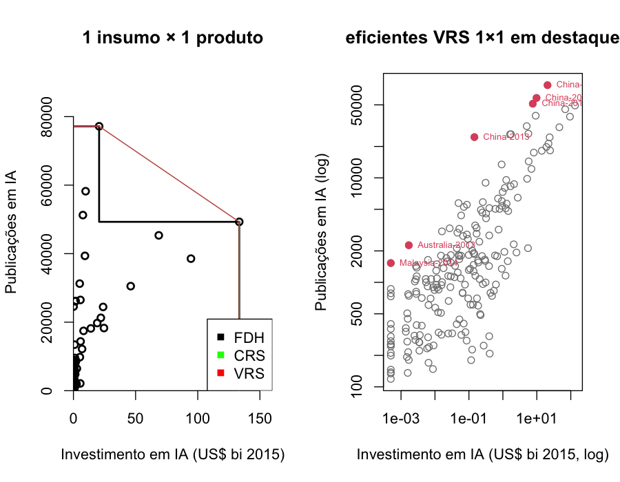
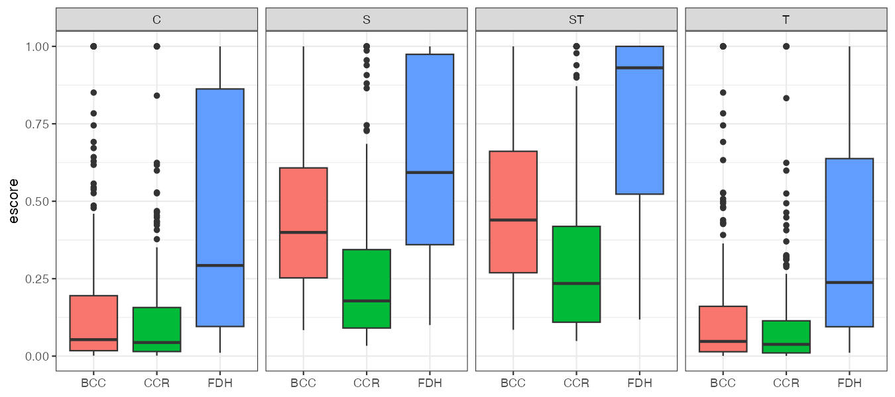
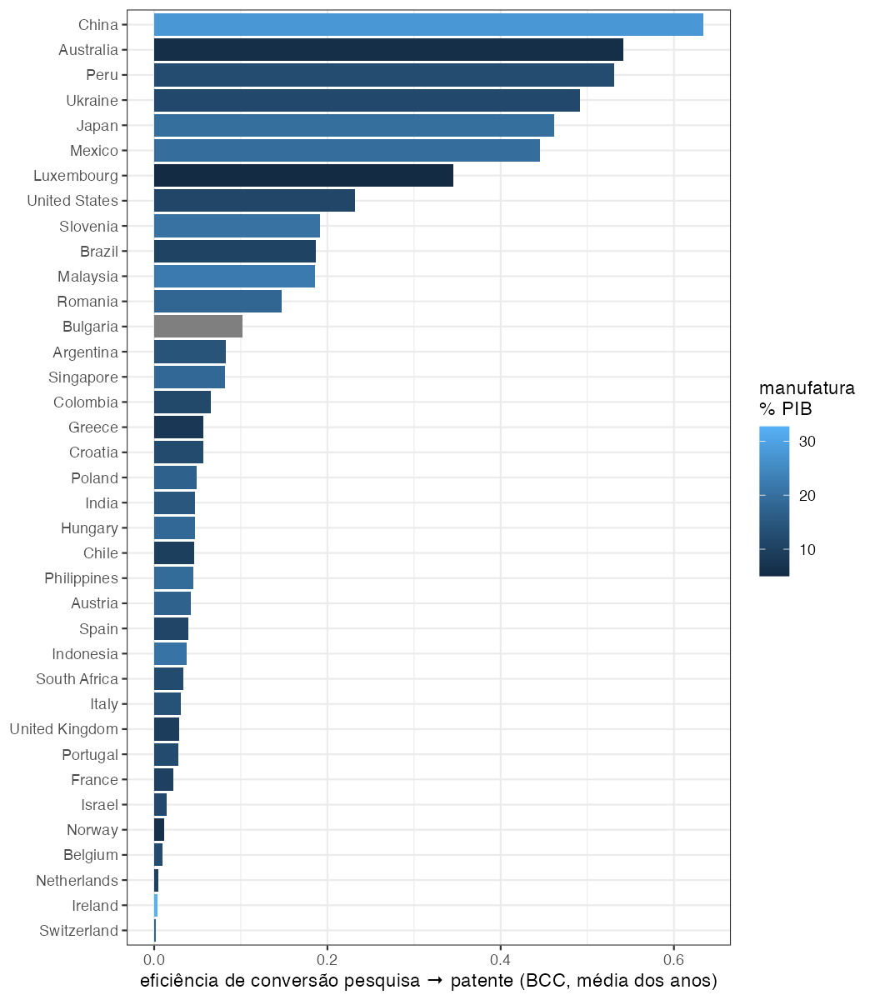
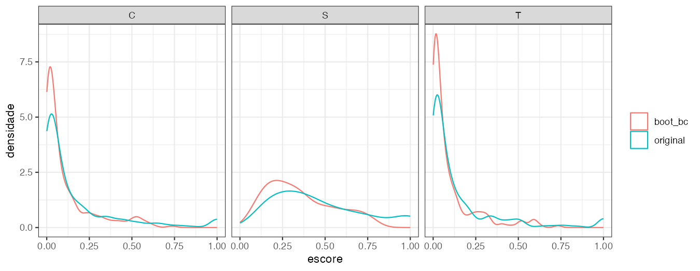
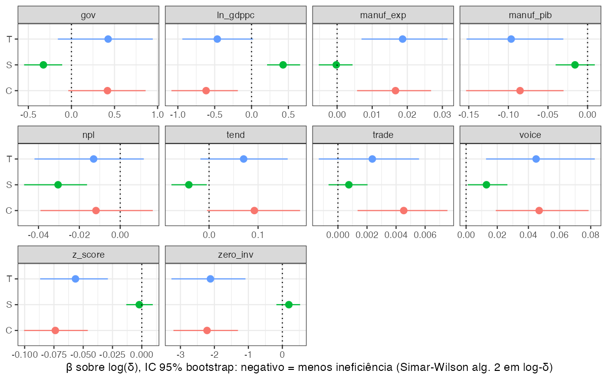
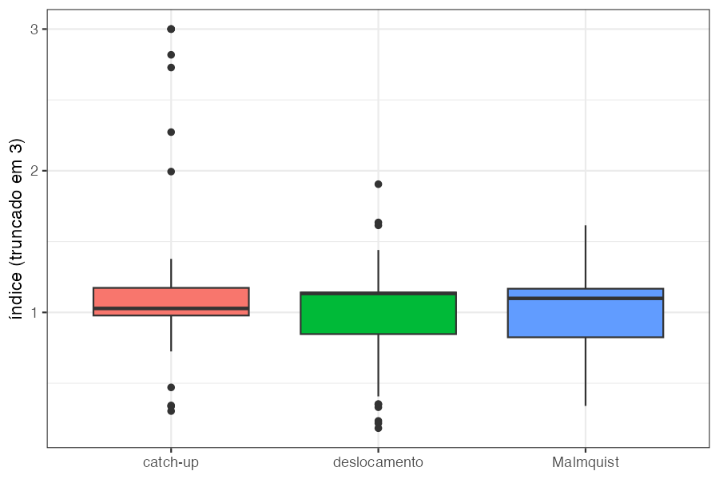

# Eficiência do investimento em IA

**Autor:** Fernando Silva · **Disciplina:** Introdução à Análise de Eficiência em R

Este relatório apresenta o trabalho sobre eficiência do investimento em IA. Cada seção parte de um resultado obtido, analisa o que ele revela e registra a melhoria que foi incorporada ao trabalho a partir dessa análise.

O bloco marcado **R** é o código que rodou; o bloco **saída** é o que o console devolveu.

---

## 1. Pergunta e hipóteses

**Pergunta:** Quão eficientes são os países em converter esforço financeiro em IA — investimento privado em IA e gasto em P&D — em produção científica (publicações) e tecnológica (patentes) em IA, e a base industrial condiciona essa conversão?

O desenho adotado é o seguinte: insumos = investimento em IA e P&D; produtos = publicações e patentes de IA; CCR e BCC para ter o contrafactual de retornos de escala; um segundo estágio com contextuais, com uma proxy de base industrial; zeros mantidos com um deslocamento; painel desbalanceado.

- **H1.** Países com maior participação da manufatura no PIB são mais eficientes em produzir patentes (modelo T) e em converter pesquisa em patente (modelo C).
- **H2.** A base industrial importa menos para a eficiência científica (modelo S) do que para a tecnológica: a assimetria ciência–tecnologia é institucional, não de volume.
- **Exploratórias.** Qualidade institucional e solidez financeira afetam a eficiência; a fronteira se deslocou com a explosão do investimento (Malmquist).

Quatro modelos de fronteira aparecem daqui em diante e vale fixá-los agora. Todos usam a mesma fronteira única com as 208 observações país-ano, orientada a produto, estimada em CCR e BCC; o que muda entre eles é só o que entra como insumo e como produto.

| Modelo | Insumos | Produto | Pergunta que responde |
|---|---|---|---|
| **S**, científico | investimento em IA, P&D | publicações | quanta ciência sai por dólar gasto |
| **T**, tecnológico | investimento em IA, P&D | patentes | quanta tecnologia sai por dólar gasto |
| **ST**, síntese | investimento em IA, P&D | publicações e patentes | os dois produtos na mesma fronteira |
| **C**, conversão | publicações, investimento em IA, P&D | patentes | quantas patentes saem dado o dinheiro e a ciência já produzida |

Tudo em dólares de 2015 e em contagem. O modelo C é o que testa diretamente a hipótese sobre pesquisa que vira patente: ele coloca as publicações do lado dos insumos, e por isso substitui a diferença entre dois escores que a v2 propunha como variável dependente.

O que contaria como resposta: H1 respondida se o coeficiente da manufatura no segundo estágio for positivo sobre o escore de patentes e sobrevivesse a mudanças de unidades, de estimador e de amostra. H2 respondida se o mesmo coeficiente fosse fraco ou nulo sobre o escore de publicações. Os instrumentos da disciplina entram assim: FDH, CCR e BCC para as fronteiras; folgas, supereficiência e Order-m para os outliers; bootstrap para os intervalos; SFA como contraparte paramétrica; Malmquist para a dinâmica; fusões e TOPSIS como leituras complementares; Tobit e regressão truncada bootstrap para o segundo estágio.

Preparação comum a todos os trechos:

```r
# Preparação comum aos trechos deste relatório: base tratada pelo pipeline
# (resultados/base_v3.csv) e funções auxiliares no padrão do template.
suppressPackageStartupMessages({
  library(tidyverse)
  library(Benchmarking)
  library(rDEA)
  library(nonparaeff)
  library(censReg)
  library(truncreg)
  library(sandwich)
  library(lmtest)
})
select <- dplyr::select
filter <- dplyr::filter
lag <- dplyr::lag
dea <- Benchmarking::dea
set.seed(1)

dados <- read_csv("resultados/base_v3.csv", show_col_types = FALSE) %>%
  mutate(inv_bi = AI.Investment / 1e9)
x.extensivo <- as.matrix(dados[, c("inv_usd", "rd_usd")])  # forma da v3
y.ambos <- as.matrix(dados[, c("pubs", "pat")])

Escore <- function(modelo) {
  # Escore em (0, 1], como no template da disciplina (1 / eff).
  pmin(1 / eff(modelo), 1)
}

PorAno <- function(x, y, rts = "vrs") {
  # Estima uma fronteira por ano e devolve o escore de cada DMU.
  escore <- rep(NA_real_, nrow(dados))
  for (ano in unique(dados$Year)) {
    linhas <- which(dados$Year == ano)
    escore[linhas] <- Escore(dea(x[linhas, , drop = FALSE],
                                 y[linhas, , drop = FALSE],
                                 RTS = rts, ORIENTATION = "out"))
  }
  escore
}

Spearman <- function(a, b) {
  # Correlação de postos, arredondada para leitura.
  round(cor(a, b, method = "spearman", use = "complete.obs"), 3)
}
```


---

## 2. Primeiro passo: entender o que a base mede

Antes de estimar qualquer fronteira, cada coluna da base foi testada para saber o que de fato mede. Duas variáveis decidiram tudo o que veio depois.

```r
# O que a base mede? As patentes per capita viram inteiros quando
# multiplicadas pela população?
dados %>%
  filter(Year == 2021) %>%
  arrange(desc(AI.Patent.Applications)) %>%
  slice(1:4) %>%
  transmute(Country,
            pat_pm = round(AI.Patent.Applications, 1),
            pop_mi = round(pop_mi, 1),
            pat_cnt = round(pat),
            pubs = AI.Publications)
fracao <- dados$pat %% 1
cat("contagens a menos de 0,02 de um inteiro:",
    round(100 * mean(pmin(fracao, 1 - fracao) < 0.02)),
    "% (esperado ao acaso: 4%)\n")
cat("cor(log publicações, log população) =",
    round(cor(log(dados$AI.Publications), log(dados$pop_mi)), 2),
    "| cor(log patentes per capita, log população) =",
    round(cor(log(dados$AI.Patent.Applications), log(dados$pop_mi)), 2), "\n")
cat("zeros em AI.Investment:", sum(dados$zero_inv),
    "| menor valor positivo: US$",
    formatC(min(dados$AI.Investment[dados$AI.Investment > 0]),
            format = "d", big.mark = ".", decimal.mark = ","), "\n")
cat("colunas log_* são log1p? max|log_RD_Percentage - log1p(R.D_Percentage)| =",
    signif(max(abs(dados$log_RD_Percentage -
                     log1p(dados$R.D_Percentage))), 2), "\n")
```

```text
# A tibble: 4 × 5
  Country       pat_pm pop_mi pat_cnt  pubs
  <chr>          <dbl>  <dbl>   <dbl> <dbl>
1 China           59.9 1412.    84611 77180
2 Luxembourg      59.3    0.6      38   248
3 Japan           23.6  126.     2964  9556
4 United States   20.9  332      6945 49289
contagens a menos de 0,02 de um inteiro: 58 % (esperado ao acaso: 4%)
cor(log publicações, log população) = 0.71 | cor(log patentes per capita, log população) = -0.03 
zeros em AI.Investment: 17 | menor valor positivo: US$ 1.000.000 
colunas log_* são log1p? max|log_RD_Percentage - log1p(R.D_Percentage)| = 7.4e-10 
```


> **Diagnóstico.** `AI.Patent.Applications` é patentes **por milhão de habitantes** (China 59,9 e Luxemburgo 59,3 no mesmo ano só fazem sentido per capita; multiplicada pela população, 58 % das observações viram inteiros). `AI.Publications` é **contagem absoluta** (correlação 0,71 com a população). Os 17 zeros de investimento aparecem numa fonte que arredonda a milhões, então "zero" pode ser "menos de meio milhão". E as colunas `log_*` da base são `log1p`, não `log`: as que se aplicam a razões pequenas são iguais ao nível.

A série de patentes também mostra um segundo problema: em 2020 e 2021 ela cai em 64 % dos países enquanto as publicações continuam subindo, o padrão típico de truncamento à direita por defasagem de publicação dos pedidos. O modelo de patentes nos anos finais precisa de uma sensibilidade que pare em 2019.

---

## 3. A primeira proposta e o resultado que parecia bom demais

A v2 usava as variáveis previstas no desenho, mas com unidades mistas: investimento em dólares, P&D em % do PIB, publicações em contagem e patentes per capita, com uma fronteira por ano. A ideia era comparar o escore científico (S) com o tecnológico (T) e explicar a diferença.

```r
# Especificação da v2: fronteiras anuais; insumos = investimento em US$ bi
# (+ US$ 10 mi) e P&D em % do PIB; produto = publicações (contagem) no
# modelo S e patentes PER CAPITA no modelo T.
x.v2 <- cbind(dados$inv_bi + 0.01, dados$R.D_Percentage)
escore.s <- PorAno(x.v2, cbind(dados$AI.Publications))
escore.t <- PorAno(x.v2, cbind(dados$AI.Patent.Applications))
cat("Spearman(S, T) =", Spearman(escore.s, escore.t), "\n")
por.pais <- dados %>%
  mutate(gap = escore.t - escore.s) %>%
  group_by(Country) %>%
  summarise(gap = mean(gap),
            log_pop = log(mean(pop_mi)),
            log_pibpc = log(mean(GDP.per.capita))) %>%
  arrange(gap)
cat("S >> T (publica, não patenteia):",
    paste(head(por.pais$Country, 6), round(head(por.pais$gap, 6), 2),
          collapse = ", "), "\n")
cat("T >> S:",
    paste(rev(tail(por.pais$Country, 3)),
          round(rev(tail(por.pais$gap, 3)), 2), collapse = ", "), "\n")
cat("cor(gap, log população) =",
    round(cor(por.pais$gap, por.pais$log_pop), 2), "\n")
round(summary(lm(gap ~ log_pop + log_pibpc,
                 data = por.pais))$coefficients, 3)
```

```text
Spearman(S, T) = 0.246 
S >> T (publica, não patenteia): India -0.93, Italy -0.86, Poland -0.73, Spain -0.68, Malaysia -0.62, Brazil -0.57 
T >> S: Luxembourg 0.83, Singapore 0.77, Slovenia 0.72 
cor(gap, log população) = -0.53 
            Estimate Std. Error t value Pr(>|t|)
(Intercept)   -0.432      0.701  -0.616    0.542
log_pop       -0.105      0.040  -2.618    0.013
log_pibpc      0.060      0.063   0.961    0.344
```


O resultado era vendável: "o Brasil converte investimento em artigo, não em patente", com Índia, Itália, Polônia e Espanha na mesma lista e Luxemburgo e Singapura do outro lado.

> **Diagnóstico.** O gap entre T e S tem correlação −0,53 com o log da população, e na regressão só a população explica o gap (coeficiente −0,105, p = 0,013; PIB per capita não). O modelo S, em contagem, premia países grandes; o modelo T, per capita, premia países pequenos e ricos. A "lista dos que publicam e não patenteiam" era, em boa parte, a lista dos países populosos.

Os mesmos modelos foram reestimados com unidades consistentes, nas duas formas possíveis.

```r
# Mesmos modelos com unidades consistentes: (a) tudo per capita;
# (b) tudo em contagem e dólares, que é a forma adotada na v3.
x.intensivo <- cbind(dados$inv_pc, dados$rd_pct)
escore.s.pc <- PorAno(x.intensivo, cbind(dados$pubs_pm))
escore.t.pc <- PorAno(x.intensivo, cbind(dados$pat_pm))
escore.s.cont <- PorAno(x.extensivo, cbind(dados$pubs))
escore.t.cont <- PorAno(x.extensivo, cbind(dados$pat))

GapPais <- function(ciencia, tecnologia) {
  # Gap médio por país entre o escore tecnológico e o científico.
  dados %>%
    mutate(gap = tecnologia - ciencia) %>%
    group_by(Country) %>%
    summarise(gap = round(mean(gap), 2)) %>%
    deframe()
}
paises <- c("Brazil", "India", "Spain", "Italy", "Luxembourg", "Singapore",
            "United States")
cbind(v2_mista = GapPais(escore.s, escore.t)[paises],
      per_capita = GapPais(escore.s.pc, escore.t.pc)[paises],
      contagem = GapPais(escore.s.cont, escore.t.cont)[paises])
cat("Spearman do escore S: v2 × per capita =",
    Spearman(escore.s, escore.s.pc), "| v2 × contagem =",
    Spearman(escore.s, escore.s.cont), "\n")
cat("Spearman do escore T: v2 × per capita =",
    Spearman(escore.t, escore.t.pc), "| v2 × contagem =",
    Spearman(escore.t, escore.t.cont), "\n")
```

```text
              v2_mista per_capita contagem
Brazil           -0.57       0.04    -0.31
India            -0.93      -0.07    -0.75
Spain            -0.68      -0.40    -0.76
Italy            -0.86      -0.74    -0.90
Luxembourg        0.83      -0.05     0.07
Singapore         0.77      -0.07    -0.21
United States     0.16       0.59    -0.13
Spearman do escore S: v2 × per capita = 0.11 | v2 × contagem = 0.862 
Spearman do escore T: v2 × per capita = 0.902 | v2 × contagem = 0.751 
```


> **Melhoria incorporada.** Tudo per capita ou tudo em contagem. O Brasil sai de −0,57 para 0,04 (per capita) ou −0,31 (contagem, meio da tabela); a Índia sai de −0,93 para −0,07 ou −0,75. O ranking científico da v2 não tem relação com o ranking per capita (Spearman 0,11). A forma em contagem e dólares passou a ser a principal, por ser a leitura literal da pergunta de pesquisa, isto é, o que se investe contra o quanto se gera; a forma per capita ficou como robustez. Nenhuma conclusão sobre o escore científico pode depender de uma única forma, e o relatório registra isso.

---

## 4. Fronteira por ano ou fronteira agrupada?

O template da disciplina coloca as 115 companhia-ano numa única fronteira. A v2 fazia uma fronteira por ano, com 16 a 30 países.

```r
# Fronteiras anuais (16 a 30 DMUs) contra fronteira agrupada (208 DMUs),
# forma extensiva, modelo ST.
st.anual <- PorAno(x.extensivo, y.ambos)
st.agrupada <- Escore(dea(x.extensivo, y.ambos, RTS = "vrs",
                          ORIENTATION = "out"))
cat("n por ano:          ", paste(table(dados$Year), collapse = "   "), "\n")
cat("anual    | eficientes", round(100 * mean(st.anual >= 1 - 1e-6), 1),
    "% | média por ano:",
    paste(sprintf("%.2f", tapply(st.anual, dados$Year, mean)),
          collapse = " "), "\n")
cat("agrupada | eficientes",
    round(100 * mean(st.agrupada >= 1 - 1e-6), 1), " % | média por ano:",
    paste(sprintf("%.2f", tapply(st.agrupada, dados$Year, mean)),
          collapse = " "), "\n")
cat("Spearman(anual, agrupada) =", Spearman(st.anual, st.agrupada), "\n")
```

```text
n por ano:           22   23   23   26   26   30   24   18   16 
anual    | eficientes 36.1 % | média por ano: 0.71 0.73 0.76 0.64 0.68 0.68 0.65 0.71 0.80 
agrupada | eficientes 9.1  % | média por ano: 0.54 0.46 0.48 0.45 0.42 0.49 0.47 0.57 0.57 
Spearman(anual, agrupada) = 0.844 
```


> **Diagnóstico.** Com fronteiras anuais, 36 % das DMUs são eficientes e o escore médio sobe justamente nos anos com menos países (0,80 em 2021, com n = 16). O escore acompanhava o tamanho da amostra. Na fronteira agrupada, 9 % são eficientes e os rankings mudam de forma moderada (Spearman 0,84).

> **Melhoria incorporada.** Fronteira agrupada com as 208 observações como desenho principal, como na aula, com o ano como contextual; as fronteiras anuais viram robustez. O Malmquist cuida do deslocamento da fronteira (seção 9).





---

## 5. Os zeros e o tamanho do deslocamento

A v2 manteve os 17 zeros de investimento somando uma constante ao insumo, testou três magnitudes e concluiu que o CCR era "brutalmente sensível" ao deslocamento.

```r
# Os 17 zeros de investimento e o deslocamento proposto na v2 (US$ 1, 10 e
# 100 mi) no CCR anual, modelo ST com as unidades da v2.
for (shift in c(0.001, 0.01, 0.1)) {
  ccr <- PorAno(cbind(dados$inv_bi + shift, dados$R.D_Percentage),
                cbind(dados$AI.Publications, dados$AI.Patent.Applications),
                "crs")
  cat(sprintf(paste0("shift US$ %3.0f mi | CCR médio dos 17 zeros %.3f | ",
                     "eficientes %.1f%%\n"),
              shift * 1e3, mean(ccr[dados$zero_inv]),
              100 * mean(ccr[dados$zero_inv] >= 1 - 1e-6)))
}
cat("menor investimento positivo: US$ 1 mi | mediana: US$ 89,6 mi\n")
# O BCC orientado a produto é invariante a translações do insumo
# (Ali & Seiford, 1990):
bcc.1mi <- PorAno(cbind(dados$inv_bi + 0.001, dados$R.D_Percentage),
                  cbind(dados$AI.Publications))
bcc.100mi <- PorAno(cbind(dados$inv_bi + 0.1, dados$R.D_Percentage),
                    cbind(dados$AI.Publications))
cat("max |BCC(shift 1 mi) - BCC(shift 100 mi)| =",
    signif(max(abs(bcc.1mi - bcc.100mi)), 2), "\n")
# v3: deslocamento de metade do menor positivo (US$ 0,5 mi) e robustez sem
# os zeros, na fronteira agrupada.
positivos <- which(!dados$zero_inv)
sem.zeros <- Escore(dea(x.extensivo[positivos, ], y.ambos[positivos, ],
                        RTS = "vrs", ORIENTATION = "out"))
cat("Spearman(ST agrupada com os zeros, sem os zeros) =",
    Spearman(st.agrupada[positivos], sem.zeros), "\n")
```

```text
shift US$   1 mi | CCR médio dos 17 zeros 0.791 | eficientes 58.8%
shift US$  10 mi | CCR médio dos 17 zeros 0.585 | eficientes 23.5%
shift US$ 100 mi | CCR médio dos 17 zeros 0.319 | eficientes 5.9%
menor investimento positivo: US$ 1 mi | mediana: US$ 89,6 mi
max |BCC(shift 1 mi) - BCC(shift 100 mi)| = 2.2e-15 
Spearman(ST agrupada com os zeros, sem os zeros) = 0.988 
```


> **Diagnóstico.** As constantes testadas (1, 10 e 100 milhões) eram uma, dez e cem vezes o menor valor positivo da base, e a maior delas passa da mediana da amostra. Somar 100 milhões a todos não é uma translação dos zeros, é uma distorção da variável inteira. Por outro lado, o BCC orientado a produto é invariante a translações do insumo (Ali & Seiford, 1990), e a saída confirma: diferença de 2e-15 entre os deslocamentos.

> **Melhoria incorporada.** Deslocamento de US\$ 0,5 milhão (metade do menor valor positivo), robustez com a amostra sem os zeros (Spearman 0,988 com a amostra completa) e eficiência de escala reportada só para as observações com investimento positivo, porque sob CCR ela é indefinida para os zeros. A dummy de zero entra no segundo estágio.

---

## 6. O núcleo da v3 e o que ele mostra

Com unidades consistentes e fronteira agrupada, o trabalho estima quatro modelos: **S** (investimento, P&D → publicações), **T** (→ patentes), **ST** (→ ambos) e **C** (publicações, investimento, P&D → patentes), este último o teste direto da hipótese sobre pesquisa que vira patente.

| Modelo | FDH eficientes | CCR eficientes | BCC eficientes | BCC média | Zeros eficientes (BCC) | Não-zeros eficientes |
|---|---|---|---|---|---|---|
| S | 25,0 % | 2,4 % | 7,7 % | 0,459 | 23,5 % | 6,3 % |
| T | 18,3 % | 1,9 % | 3,4 % | 0,146 | 11,8 % | 2,6 % |
| ST | 46,6 % | 4,8 % | 9,1 % | 0,486 | 29,4 % | 7,3 % |
| C | 22,6 % | 1,9 % | 3,8 % | 0,165 | 17,6 % | 2,6 % |

Três coisas saltam da leitura dos escores por país (tabela `t03_medias_pais.csv`):

- **Quem está na fronteira.** Em S: Austrália-2013, China (2013, 2019–2021), Índia (2013, 2016, 2019, 2020), Malásia-2014, Peru (2018, 2021), Romênia (2018, 2020), Ucrânia (2017, 2018). Em T: Austrália-2013, China (2013, 2020, 2021), México-2018, Peru-2018, Ucrânia-2014. Peru, Ucrânia, Malásia e Romênia entram por terem insumos minúsculos; a supereficiência CRS confirma (Ucrânia-2014 1,81; Malásia-2014 1,78). Israel, com o maior investimento por habitante, é o menos eficiente em ST (0,11). O modelo mede publicações e patentes por dólar de capital de risco e de P&D, e onde há muito capital de risco essa razão é naturalmente baixa. Isso fica registrado no artigo.
- **O Brasil** fica em 10º de 37 na conversão pesquisa → patente (0,19) e em 0,36 na síntese ST. Nada de "publica e não patenteia".
- **Os últimos da conversão** são Suíça, Irlanda, Holanda, Bélgica, Noruega e Israel, com patentes de IA quase nulas. São exatamente os países que patenteiam via EPO/PCT. Isso sugere que a variável conta pedidos em escritórios nacionais, e é a pendência de dados mais importante do trabalho, retomada nas seções 10 e 11.



Robustez do núcleo (Spearman com o escore principal): forma per capita 0,12 para S, 0,90 para T e 0,94 para C; fronteiras anuais 0,84; deslocamento de 1 milhão 1,00; sem os zeros 0,99; patentes só até 2019 0,99; sem Luxemburgo e Singapura 1,00; insumos defasados em um ano 0,89. T e C são estáveis; S não é.

---

## 7. Bootstrap: quando o pacote devolve escores negativos

O bootstrap de Simar-Wilson foi estimado exatamente como na Lecture 03.

```r
# Bootstrap de Simar-Wilson como na aula (rDEA::dea.robust), modelo T na
# fronteira agrupada.
boot <- dea.robust(x.extensivo, as.matrix(dados$pat), model = "output",
                   RTS = "variable", B = 500, alpha = 0.05)
summary(boot$theta_hat_hat)  # corrigidos de viés, como saem do pacote
cat("escores negativos:", sum(boot$theta_hat_hat < 0), "de",
    length(boot$theta_hat_hat), "\n")
# Mudança: a mesma correção, feita na escala de Farrell (phi = 1 / theta)
# com as réplicas que o pacote devolve.
phi <- 1 / boot$theta_hat
phi.star <- 1 / boot$theta_hat_star
vies <- rowMeans(phi.star - phi)
theta.bc <- 1 / (phi - vies)
summary(theta.bc)
cat("negativos:", sum(theta.bc < 0), "| Spearman com o escore original:",
    Spearman(theta.bc, boot$theta_hat), "\n")
```

```text
      Min.    1st Qu.     Median       Mean    3rd Qu.       Max. 
-76.563386  -0.007497   0.001707  -0.453037   0.013903   0.396542 
escores negativos: 77 de 208 
     Min.   1st Qu.    Median      Mean   3rd Qu.      Max. 
0.0004544 0.0100638 0.0349273 0.0965479 0.1085532 0.7343388 
negativos: 0 | Spearman com o escore original: 0.999 
```


> **Diagnóstico.** O `rDEA` corrige o viés na escala do escore (0 a 1) e, com a cauda pesada do modelo de patentes, o viés estimado supera o próprio escore: 77 escores negativos em 208, mínimo de −76. O mesmo aparece na Lecture 03 (mínimo −0,32 na saída da aula), só que aqui a cauda é muito mais longa.

> **Melhoria incorporada.** A correção refeita na escala de Farrell (φ = 1/θ) com as réplicas que o próprio pacote devolve: nenhum negativo, escore corrigido médio 0,097 contra 0,146 original, e ranking preservado (Spearman 0,999). O `scripts/pipeline_v3.R` faz isso para S, T e C.



---

## 8. Segundo estágio: do gap em OLS ao Algoritmo 2 em log(δ)

A v2 propunha regredir o gap T − S por OLS com vinte parâmetros para 37 países. Essa escolha foi abandonada por três razões: não é o segundo estágio da aula (Tobit e `dea.env.robust`), a diferença de dois escores limitados e dependentes herda os problemas dos dois, e a variável "anos desde o primeiro investimento" media apenas "anos na amostra" (em 28 dos 36 países o primeiro ano positivo é o primeiro ano observado).

O Algoritmo 2 foi então estimado como na Lecture 04.

```r
# Segundo estágio como na aula: rDEA::dea.env.robust é o Algoritmo 2 de
# Simar-Wilson com regressão truncada LINEAR em delta.
contextuais <- dados %>%
  transmute(manuf_pib, manuf_exp, gov, ln_gdppc,
            trade = Trade_Percentage, z_score = Z_Score,
            npl = Non.performing.Loans, zero_inv = as.numeric(zero_inv),
            tend)
completas <- complete.cases(contextuais)
y.patentes <- as.matrix(dados$pat)
linear <- dea.env.robust(x.extensivo[completas, ],
                         y.patentes[completas, , drop = FALSE],
                         Z = contextuais[completas, ], model = "output",
                         RTS = "variable", L1 = 50, L2 = 500, alpha = 0.05)
cat("delta = distância à fronteira: mediana",
    round(median(linear$delta_hat), 1), "| máximo",
    round(max(linear$delta_hat), 1), "| sigma_hat =",
    round(linear$sigma_hat, 1), "\n")
tabela <- cbind(beta = linear$beta_hat, IC_inf = linear$beta_ci[, 1],
                IC_sup = linear$beta_ci[, 2])
rownames(tabela) <- c("(Intercepto)", colnames(contextuais))
round(tabela[2:4, ], 2)

# Mudança: o mesmo Algoritmo 2 com a regressão truncada em log(delta),
# porque delta tem cauda pesada.
AmostraNormalTruncada <- function(media, desvio) {
  # Normal truncada à esquerda em zero: media + eps, com eps >= -media.
  u <- runif(length(media))
  limite <- pnorm(-media / desvio)
  media + desvio * qnorm(limite + u * (1 - limite))
}

AjustaTruncada <- function(y, z) {
  # Regressão truncada de y sobre as contextuais, truncatura em zero.
  dados.ajuste <- data.frame(y = y, z)
  truncreg(y ~ ., data = dados.ajuste[y > 1e-9, ], point = 0,
           direction = "left")
}

SimarWilsonLog <- function(x, y, z, l1 = 50, l2 = 500) {
  # Algoritmo 2 de Simar-Wilson com a regressão truncada em log(delta).
  z <- as.matrix(z)
  n.z <- ncol(z)
  delta <- eff(dea(x, y, RTS = "vrs", ORIENTATION = "out"))
  ajuste1 <- AjustaTruncada(log(delta), z)
  beta1 <- coef(ajuste1)[1:(n.z + 1)]
  sigma1 <- coef(ajuste1)[["sigma"]]
  media1 <- as.numeric(cbind(1, z) %*% beta1)
  delta.star <- sapply(1:l1, function(b) {
    y.star <- y * delta / exp(AmostraNormalTruncada(media1, sigma1))
    eff(dea(x, y, RTS = "vrs", ORIENTATION = "out", XREF = x, YREF = y.star))
  })
  delta.bc <- pmax(delta - (rowMeans(delta.star) - delta), 1 + 1e-6)
  ajuste2 <- AjustaTruncada(log(delta.bc), z)
  beta2 <- coef(ajuste2)[1:(n.z + 1)]
  sigma2 <- coef(ajuste2)[["sigma"]]
  media2 <- as.numeric(cbind(1, z) %*% beta2)
  betas <- t(sapply(1:l2, function(b) {
    replica <- AmostraNormalTruncada(media2, sigma2)
    coef(AjustaTruncada(replica, z))[1:(n.z + 1)]
  }))
  list(beta = beta2, ci = t(apply(betas, 2, quantile, c(.025, .975))),
       sigma = sigma2)
}

# Os avisos de NaN vêm da verossimilhança do truncreg em pontos extremos.
log.delta <- suppressWarnings(
  SimarWilsonLog(x.extensivo[completas, ],
                 y.patentes[completas, , drop = FALSE],
                 contextuais[completas, ]))
cat("sigma =", round(log.delta$sigma, 2), "\n")
round(cbind(beta = log.delta$beta, IC_inf = log.delta$ci[, 1],
            IC_sup = log.delta$ci[, 2])[2:4, ], 3)
```

```text
delta = distância à fronteira: mediana 21.2 | máximo 1456.2 | sigma_hat = 720.1 
             beta  IC_inf  IC_sup
manuf_pib -446.31 -751.48 -534.29
manuf_exp   76.35  104.65  149.41
gov        289.22  417.66  558.84
sigma = 1.48 
            beta IC_inf IC_sup
manuf_pib -0.142 -0.198 -0.083
manuf_exp  0.021  0.010  0.032
gov        0.708  0.180  1.140
```


> **Diagnóstico.** No modelo de patentes a distância à fronteira tem mediana 21 e máximo acima de 1.400. A regressão truncada linear em δ não aguenta: σ̂ = 720 e intervalos que nem contêm a estimativa pontual. Em S, onde δ é moderado, a versão linear funciona.

> **Melhoria incorporada.** O mesmo Algoritmo 2, com a regressão truncada em **log(δ)** (`truncreg`, truncatura em zero), implementado em R com os mesmos dois laços de bootstrap. A regressão fica bem comportada (σ̂ = 1,48) e o coeficiente da manufatura sai negativo sobre a ineficiência, −0,142 com intervalo [−0,198; −0,083]: mais manufatura, menos distância à fronteira. Os avisos de `NaN` são da verossimilhança do `truncreg` em pontos extremos durante a otimização e não afetam o ajuste.

No Tobit (`censReg`, como na aula) e no OLS com erros agrupados por país, sem a variável de voice, o resultado era o mesmo: manufatura positiva e significativa em T e C (Tobit p < 1e-5; OLS agrupado p 0,02–0,03) e fraca em S. Até aqui, H1 parecia respondida e H2 também.



---

## 9. O que mais o template mostrou

```r
# SFA como na aula (Benchmarking::sfa), Cobb-Douglas em log: modelo S
# (publicações) e modelo T (patentes).
sfa.s <- sfa(log(x.extensivo), log(dados$pubs))
sfa.t <- sfa(log(x.extensivo), log(dados$pat))
cat("S: lambda =", round(lambda.sfa(sfa.s)[1], 2), "| T: lambda =",
    round(lambda.sfa(sfa.t)[1], 2), "\n")
bcc.t <- Escore(dea(x.extensivo, as.matrix(dados$pat), RTS = "vrs",
                    ORIENTATION = "out"))
cat("T: elasticidades (investimento, P&D) =",
    paste(round(coef(sfa.t)[2:3], 2), collapse = " / "), "| TE média =",
    round(mean(te.sfa(sfa.t)), 2), "| cor(TE_SFA, BCC_T) =",
    round(cor(te.sfa(sfa.t), bcc.t), 2), "\n")
```

```text
S: lambda = -1.39 | T: lambda = 0.53 
T: elasticidades (investimento, P&D) = 0.14 / 0.98 | TE média = 0.61 | cor(TE_SFA, BCC_T) = 0.62 
Warning message: lambda is negative.
  This could indicate that there is no inefficiency,
  or that the model is misspecified.
```


> **Diagnóstico.** No modelo de publicações o SFA não identifica ineficiência (λ negativo: os resíduos têm a assimetria "errada"). Não é defeito de código, é heterogeneidade entre países dominando o termo de ineficiência, o que combina com o resultado das classes latentes (duas classes que separam sistemas grandes de pequenos, não renda). No modelo de patentes o SFA funciona: 22 % da variância é ineficiência, elasticidade de quase 1 em P&D, correlação 0,62 com o BCC.

```r
# A v2 rebaixou o Malmquist alegando painel desbalanceado. No subpainel
# 2016-2021 ele roda como na aula (nonparaeff::faremalm2).
balanceado <- dados %>%
  group_by(Country) %>%
  filter(all(2016:2021 %in% Year)) %>%
  ungroup() %>%
  filter(Year %in% 2016:2021) %>%
  arrange(Country, Year)
entrada <- data.frame(id = balanceado$Country, year = balanceado$Year,
                      y = balanceado$pubs, x1 = balanceado$inv_usd,
                      x2 = balanceado$rd_usd)
invisible(capture.output(
  malm <- faremalm2(entrada, noutput = 1, id = "id", year = "year")))
MediaGeometrica <- function(v) exp(mean(log(v)))
cat(n_distinct(balanceado$Country), "países | Malmquist =",
    round(MediaGeometrica(malm$pc), 3), "| catch-up =",
    round(MediaGeometrica(malm$ec), 3), "| deslocamento da fronteira =",
    round(MediaGeometrica(malm$tc), 3), "\n")
# FDH e Order-m (nonparaeff::orderm), modelo S na fronteira agrupada.
fdh <- Escore(dea(x.extensivo, as.matrix(dados$pubs), RTS = "fdh",
                  ORIENTATION = "out"))
cat("FDH agrupada: eficientes", round(100 * mean(fdh >= 1 - 1e-6)),
    "% (anual: 53%)\n")
invisible(capture.output(
  order.m <- orderm(data.frame(x.extensivo, dados$pubs), noutput = 1,
                    orientation = 2, M = 25, B = 100)))
cat("order-m (m = 25): lambda_m mediano", round(median(order.m$eff), 2),
    "| acima da fronteira parcial (eff < 1):",
    round(100 * mean(order.m$eff < 1)), "%\n")
```

```text
13 países | Malmquist = 0.971 | catch-up = 1.089 | deslocamento da fronteira = 0.891 
FDH agrupada: eficientes 25 % (anual: 53%)
order-m (m = 25): lambda_m mediano 5.94 | acima da fronteira parcial (eff < 1): 16 %
```


> **Diagnóstico.** A v2 tinha rebaixado o Malmquist "por causa do painel desbalanceado". Ele roda como na aula no subpainel 2016–2021 (13 países) e diz algo substantivo: a fronteira de publicações por dólar recuou (deslocamento 0,891) enquanto o investimento mediano subiu de 9 para 243 milhões de dólares, com catch-up de 1,089. O FDH continua pouco informativo (25 % eficientes na fronteira agrupada, 53 % nas anuais) e o Order-m coloca a mediana dos países a seis vezes o produto esperado dos 25 melhores pares.

Fusões como blocos regionais (Mercosul, Aliança do Pacífico, Benelux, Ibéria, Visegrád, Leste da UE) mostram ganho de harmonia em todos os blocos (4 a 21 %) e perda de escala em todos (o bloco fundido cai na região de retornos decrescentes); o TOPSIS com pesos iguais premia volume e coloca a China no topo em todos os anos.



---

## 10. A reviravolta: Voice & Accountability

O desenho previa três variáveis institucionais: controle de corrupção, efetividade do governo e voz e responsabilização. As duas primeiras já estavam na base e têm correlação 0,95 entre si, por isso foram combinadas num índice único; Voice & Accountability foi acrescentada em 20/09, a partir de arquivo do WGI.

```r
# Voice & Accountability (WGI) entra nas contextuais: Tobit (censReg) e OLS
# com erros por país sobre o escore de conversão C.
escore.c <- Escore(dea(as.matrix(dados[, c("pubs", "inv_usd", "rd_usd")]),
                       as.matrix(dados$pat), RTS = "vrs",
                       ORIENTATION = "out"))
reg <- cbind(y = escore.c, Country = dados$Country, contextuais,
             voice = dados$voice)[completas, ]
sem.voice <- y ~ manuf_pib + manuf_exp + gov + ln_gdppc + trade + z_score +
  npl + zero_inv + tend
com.voice <- update(sem.voice, . ~ . + voice)

ResumoH1 <- function(formula.reg, amostra) {
  # Coeficiente da manufatura no Tobit e no OLS com erros por país.
  estimativas <- summary(censReg(formula.reg, left = 0, right = 1,
                                 data = amostra))$estimate
  modelo <- lm(formula.reg, data = amostra)
  teste <- coeftest(modelo,
                    vcov = vcovCL(modelo, cluster = amostra$Country))
  sprintf("manuf_pib: Tobit %.4f (p %.3f) | OLS-cluster p %.3f | n = %d",
          estimativas["manuf_pib", 1], estimativas["manuf_pib", 4],
          teste["manuf_pib", 4], nrow(amostra))
}
cat("sem voice:", ResumoH1(sem.voice, reg), "\ncom voice:",
    ResumoH1(com.voice, reg), "\n")
cat("cor(manuf_pib, voice) =", round(cor(reg$manuf_pib, reg$voice), 2), "\n")
epo <- c("Switzerland", "Netherlands", "Belgium", "Ireland", "Norway",
         "Israel", "France", "Austria", "United Kingdom", "Portugal",
         "Italy", "Spain", "Greece")
reg.sem.epo <- reg[!reg$Country %in% epo, ]
cat("sem os 13 países de patente ~0, sem voice:",
    ResumoH1(sem.voice, reg.sem.epo),
    "\nsem os 13 países de patente ~0, com voice:",
    ResumoH1(com.voice, reg.sem.epo), "\n")
estimativas <- summary(censReg(com.voice, left = 0, right = 1,
                               data = reg))$estimate
cat("voice: Tobit", round(estimativas["voice", 1], 4), "(p",
    signif(estimativas["voice", 4], 2), ") | voice médio: 13 países",
    round(mean(reg$voice[reg$Country %in% epo])), "vs demais",
    round(mean(reg$voice[!reg$Country %in% epo])), "| China",
    round(mean(reg$voice[reg$Country == "China"])), "\n")
```

```text
sem voice: manuf_pib: Tobit 0.0183 (p 0.000) | OLS-cluster p 0.032 | n = 205 
com voice: manuf_pib: Tobit 0.0098 (p 0.029) | OLS-cluster p 0.265 | n = 205 
cor(manuf_pib, voice) = -0.6 
sem os 13 países de patente ~0, sem voice: manuf_pib: Tobit 0.0197 (p 0.001) | OLS-cluster p 0.025 | n = 136 
sem os 13 países de patente ~0, com voice: manuf_pib: Tobit 0.0036 (p 0.704) | OLS-cluster p 0.795 | n = 136 
voice: Tobit -0.0075 (p 0.00058 ) | voice médio: 13 países 78 vs demais 64 | China 31 
```


> **Diagnóstico.** Manufatura e voice têm correlação −0,60: nesta amostra, base industrial e democracia são quase o mesmo eixo, com economias manufatureiras asiáticas e emergentes de um lado e democracias ocidentais de outro. Quando voice entra, o coeficiente da manufatura cai pela metade e perde a significância com erros agrupados. Sem os 13 países de patente quase zero, a manufatura continua forte se voice fica fora e some quando voice entra. E voice tem sinal implausível: mais democracia, menos eficiência em patentes, com magnitude que corresponderia a 55 % mais distância à fronteira a cada dez pontos.

> **Leitura revisada.** A leitura honesta é que, com a variável de patentes atual, não dá para separar "base industrial" de "regime político ou escritório de patentes": voice separa a China (31, que define a fronteira) das democracias europeias que aparecem com patente zero por construção da variável. H1 passa de "respondida" a "plausível, com evidência frágil". Isso está registrado na tabela `t19_sensibilidade_2o_estagio.csv` e é assim que o resultado será apresentado em 28/09.

---

## 11. Situação atual

| Pergunta ou hipótese | Situação | Evidência |
|---|---|---|
| Quem é eficiente em converter esforço financeiro em ciência e tecnologia | Respondida com ressalvas | Fronteira agrupada, quatro modelos, robustez em nove cenários; ranking tecnológico estável, científico instável entre unidades |
| H1: base industrial → mais eficiência em patentes | Plausível, evidência frágil | Positiva e significativa em Tobit, OLS agrupado e Simar-Wilson sem voice; cai pela metade com voice; some sem os países de patente ≈ 0 |
| H2: base industrial importa menos para ciência | Compatível | Coeficiente fraco e instável em S em todos os estimadores; S não é robusto entre unidades |
| Instituições e solidez financeira | Inconclusivo | Voice com sinal implausível; Z-score negativo sobre a ineficiência em T e C; governança perde significância com voice |
| Dinâmica | Respondida | Malmquist: fronteira de publicações por dólar recuou; catch-up positivo |

Pendências de dados, em ordem de importância: (1) definição de `AI.Patent.Applications` (inventor ou depositante, escritório) e uma série alternativa por país do inventor (OECD.AI, WIPO); (2) escala e fonte do arquivo de Voice & Accountability (0–100, não é o percentil do WGI); (3) unidade do investimento (corrente ou constante), origem dos zeros e cobertura por país do rastreador.

---

## 12. Decisões em aberto

As melhorias das seções anteriores já estão incorporadas ao trabalho. Restam seis decisões, que dependem de discussão antes da apresentação e da submissão.

1. **Unidades.** A forma em contagem e dólares é a principal e a per capita entra como robustez. O escore científico muda de ranking entre as duas formas, e o relatório opta por registrar essa instabilidade em vez de escolher a versão de resultado mais favorável. Falta confirmar a escolha.
2. **Patentes.** Definir o tratamento dos 13 países de patente quase nula: excluí-los, marcá-los com uma variável binária ou trocar a fonte por patentes atribuídas ao país do inventor, antes de qualquer conclusão sobre H1.
3. **Algoritmo 2 em log(δ).** A versão linear do `rDEA` é instável em T e C. Definir se a reimplementação em log(δ) com `truncreg` entra no manuscrito como estimador principal ou se o Tobit assume esse papel, com a regressão truncada restrita a S.
4. **Manufatura × voice.** Definir entre reportar os dois conjuntos de contextuais lado a lado, com e sem voice, apresentando H1 como frágil, e construir um índice institucional único.
5. **Deck de 28/09.** Doze slides seguindo o template da disciplina (fronteiras, folgas, fusões, Malmquist, TOPSIS, bootstrap, SFA, Order-m, classes latentes, testes, Tobit, truncada bootstrap), com o diagnóstico setorial nos dois últimos. Falta definir se alguma técnica merece mais tempo.
6. **Periódico.** Socio-Economic Planning Sciences, Technological Forecasting & Social Change ou Journal of the Knowledge Economy. Falta escrever o parágrafo que justifica o uso de fronteira em lugar de modelos de mediação e moderação, e localizar o trabalho do grupo com esta mesma base (Fukuyama, Tan & Wanke, 2025, e o estudo econométrico correlato) para posicionar a contribuição.

---

## Anexo: reprodução

- `Rscript scripts/pipeline_v3.R` (cerca de 50 segundos) gera `resultados/t01`–`t19` e `resultados/figuras/fig01`–`fig11`; `RAPIDO=FALSE` para os valores finais. O arquivo segue o Google R Style Guide e traz o cabeçalho com entradas, saídas e modo de uso.
- `Rscript scripts/relatorio/run_prints.R` regenera as saídas deste relatório em `resultados/prints/`; `python3 scripts/relatorio/build_report.py` remonta este documento e a versão em página.
- `Rscript scripts/replica_analise_critica.R` reproduz a análise crítica da v2 sem depender de pacotes de DEA.
- Contextuais: `bash dados/baixar_wdi.sh` (WDI) e `dados/wgi.voice_accountability.csv` (WGI).
- Documentos: `documentos/proposta_v3.md` (proposta atual), `documentos/analise_critica.md` (crítica das versões anteriores), `documentos/anteriores/proposta_v2_revisada.md` e `documentos/anteriores/proposta_eficiencia_ia.md` (versões anteriores), `material_disciplina/comments.txt` (orientação transcrita).
